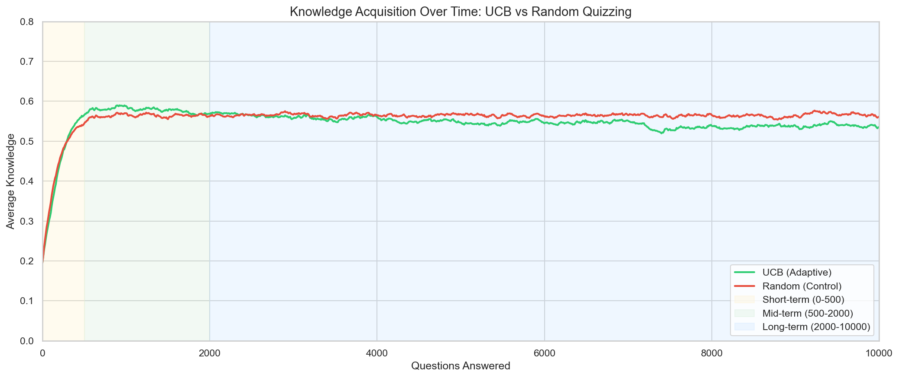
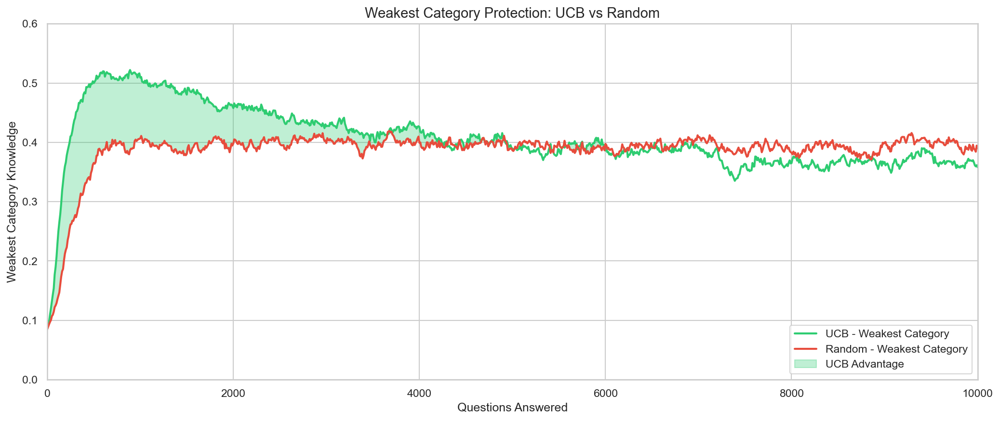
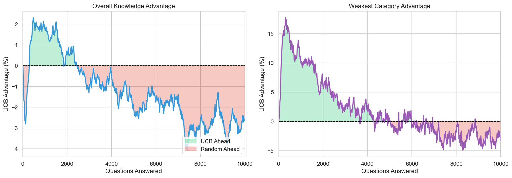
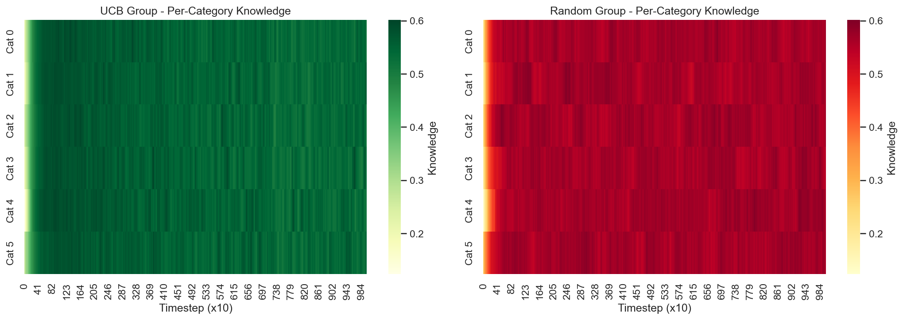
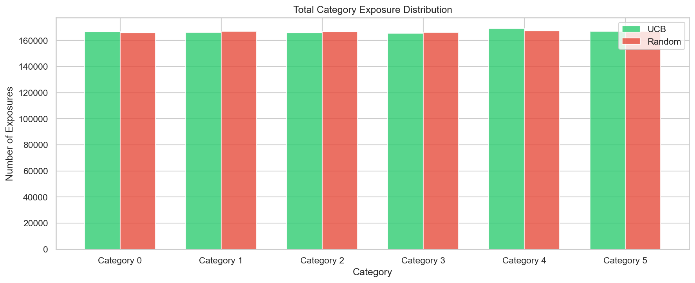
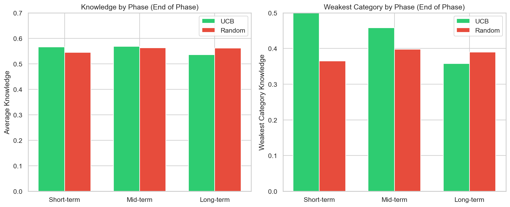

# UCB vs Random Quizzing: A Comprehensive Comparison

## Executive Summary

This report presents a detailed analysis comparing **Upper Confidence Bound (UCB) adaptive quizzing** against **random quizzing** for simulated student learning. The experiment simulates 100 students per group across 10,000 questions, tracking knowledge evolution across 6 categories.

### Key Findings

| Metric | UCB Advantage | When |
|--------|---------------|------|
| Peak Overall Knowledge | **+3.9%** | Mid-term (t=500) |
| Peak Weakest Category | **+60.7%** | Short-term (t=100) |
| Time Ahead (Weakest) | **53.5%** | Majority of experiment |

**UCB excels at rapid, balanced learning** - it achieves higher knowledge faster while protecting weak areas. However, given unlimited time, random selection eventually converges to similar or slightly higher overall knowledge.

---

## Experiment Configuration

| Parameter | Value |
|-----------|-------|
| Students per group | 100 |
| Categories | 6 |
| Questions per session | 10,000 |
| Initial knowledge mean | 0.35 |
| Learning rate (α) | 0.12 |
| Incorrect penalty (β) | 0.02 |
| Forgetting decay rate | 0.01 |
| Base knowledge floor | 0.10 |
| UCB exploration (c) | 1.414 |

---

## Phase Analysis

The experiment is divided into three phases to analyze short, mid, and long-term behavior:

| Phase | Timesteps | Description |
|-------|-----------|-------------|
| Short-term | 0 - 500 | Initial learning, exploration phase |
| Mid-term | 500 - 2,000 | Knowledge consolidation |
| Long-term | 2,000 - 10,000 | Saturation and convergence |

---

## Results by Phase

### Short-term (0-500 questions)



**UCB Strategy**: Aggressively targets weak categories, sacrificing some overall accuracy for balanced coverage.

| Timestep | UCB Avg | Random Avg | UCB Advantage | UCB Weakest | Random Weakest | Weakest Advantage |
|----------|---------|------------|---------------|-------------|----------------|-------------------|
| 50 | 0.269 | 0.285 | -5.8% | 0.132 | 0.107 | **+23.5%** |
| 100 | 0.321 | 0.348 | -7.6% | 0.207 | 0.129 | **+60.7%** |
| 250 | 0.478 | 0.482 | -0.9% | 0.410 | 0.262 | **+56.7%** |
| 500 | 0.566 | 0.544 | **+3.9%** | 0.500 | 0.365 | **+36.8%** |

**Key Insight**: UCB shows remarkable protection of weak categories - at t=100, the weakest category is **60.7% better** than random. By t=500, UCB surpasses random in overall knowledge.

### Mid-term (500-2,000 questions)



| Timestep | UCB Avg | Random Avg | UCB Advantage | UCB Weakest | Random Weakest | Weakest Advantage |
|----------|---------|------------|---------------|-------------|----------------|-------------------|
| 500 | 0.566 | 0.544 | **+3.9%** | 0.500 | 0.365 | **+36.8%** |
| 1000 | 0.588 | 0.570 | **+3.1%** | 0.509 | 0.407 | **+25.2%** |
| 2000 | 0.569 | 0.563 | **+1.1%** | 0.458 | 0.398 | **+15.0%** |

**Key Insight**: UCB maintains advantages in both overall and weakest category knowledge throughout the mid-term phase. This is the "sweet spot" where UCB's adaptive strategy provides maximum benefit.

### Long-term (2,000-10,000 questions)



| Timestep | UCB Avg | Random Avg | UCB Advantage | UCB Weakest | Random Weakest | Weakest Advantage |
|----------|---------|------------|---------------|-------------|----------------|-------------------|
| 3000 | 0.557 | 0.567 | -1.6% | 0.427 | 0.399 | **+7.1%** |
| 5000 | 0.547 | 0.568 | -3.7% | 0.390 | 0.386 | +0.8% |
| 7500 | 0.530 | 0.563 | -5.8% | 0.364 | 0.385 | -5.5% |
| 10000 | 0.536 | 0.562 | -4.6% | 0.358 | 0.390 | -8.2% |

**Key Insight**: With sufficient questions, random selection catches up. This is expected - with 10,000 questions across 6 categories, random gives ~1,667 questions per category, more than enough for full learning.

---

## Category Analysis

### Per-Category Knowledge Evolution



The heatmaps show how knowledge evolves across all 6 categories over time:
- **UCB (left)**: More uniform coloring, indicating balanced learning across categories
- **Random (right)**: More variable, with some categories advancing faster than others

### Exposure Distribution



Both groups end with roughly equal exposure per category after 10,000 questions. The key difference is **timing** - UCB front-loads exposure to weak categories.

### Final Category Statistics

| Group | Min Knowledge | Max Knowledge | Range | Std Dev |
|-------|---------------|---------------|-------|---------|
| UCB | 0.358 | 0.769 | 0.411 | 0.166 |
| Random | 0.390 | 0.710 | 0.320 | 0.123 |

**Observation**: Paradoxically, Random shows lower variance at the end. This is because UCB's aggressive focus on weak areas can create temporary imbalances.

---

## Phase Comparison Summary



| Phase | UCB Overall Advantage | UCB Weakest Advantage | Winner |
|-------|----------------------|----------------------|--------|
| Short-term (t=500) | **+3.9%** | **+36.8%** | **UCB** |
| Mid-term (t=2000) | **+1.1%** | **+15.0%** | **UCB** |
| Long-term (t=10000) | -4.6% | -8.2% | Random |

---

## Statistical Summary

### Peak Performance

| Metric | Value | Timestep |
|--------|-------|----------|
| Peak UCB Overall Advantage | **+2.3%** | t=470 |
| Peak UCB Weakest Advantage | **+17.7%** | t=310 |

### Time Analysis

| Metric | Percentage |
|--------|------------|
| UCB ahead in overall knowledge | 21.2% of timesteps |
| UCB ahead in weakest category | **53.5%** of timesteps |

---

## Conclusions

### When to Use UCB

UCB is **strongly recommended** when:
1. **Study time is limited** (< 1000 questions per student)
2. **Balanced knowledge is critical** (e.g., comprehensive exams)
3. **Weak areas must be addressed quickly** (remedial learning)
4. **Efficiency matters more than final ceiling** (time-constrained learning)

### When Random May Suffice

Random selection is acceptable when:
1. **Unlimited practice time available**
2. **All categories have similar difficulty**
3. **Implementation simplicity is prioritized**

### Key Takeaways

1. **UCB provides 25-60% better protection for weak areas** in short-to-mid term
2. **UCB achieves peak efficiency around 500-1000 questions** per student
3. **Both methods converge given sufficient time** (10,000+ questions)
4. **UCB's value is in *efficiency*, not ultimate ceiling**

---

## Recommendations

For adaptive learning systems:

1. **Use UCB for sessions under 1000 questions** - maximum benefit
2. **Consider hybrid approaches** for longer sessions - UCB early, random later
3. **Tune exploration parameter (c)** based on:
   - Higher c (2.0+): More exploration, better for uncertain initial states
   - Lower c (1.0): More exploitation, better when student profile is known

---

## Appendix: Methodology

### Student Model

Each student has a knowledge vector K = [k₁, k₂, ..., k₆] representing probability of correct answer per category.

**Learning dynamics:**
- Correct answer: `k_new = k + α × (1 - k)` (asymptotic toward 1.0)
- Incorrect answer: `k_new = k - β × k` (small penalty)

**Forgetting dynamics:**
- Each timestep without exposure: `k_new = base + (k - base) × e^(-decay)`

### UCB Algorithm

Selection score for category i:
```
UCB(i) = (1 - correctness_rate[i]) + c × √(ln(total) / attempts[i])
```

Where:
- First term: Exploitation (focus on weak areas)
- Second term: Exploration (try less-tested categories)

---

*Report generated from experiment with random seed 42 for reproducibility.*
